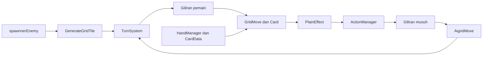

# GridTurnbased

Prototype game taktis 2D berbasis giliran. Pemain bergerak di dungeon berbentuk grid, menggunakan kartu untuk menyerang atau memberi efek, lalu menghadapi giliran musuh sebelum membuka jalan ke arena berikutnya.

> Dokumentasi portofolio ini merangkum implementasi yang ada di repository. Gambar di bawah adalah aset visual proyek, bukan screenshot gameplay.

## Visual Proyek

### Dungeon

	
	
	

### Kartu dan Peralatan

	
	
	
	

## Ringkasan Gameplay

Satu arena dimulai dengan grid, pintu, objek, dan musuh. Pemain mengatur pergerakan serta resource untuk memainkan kartu. Setelah giliran pemain diakhiri, efek tertunda diproses dan musuh bergerak atau menyerang. Saat arena bersih, pintu keluar membuka arena berikutnya.

| Fase | Yang terjadi |
| --- | --- |
| Persiapan | Arena dibuat dan kartu pemain disiapkan. |
| Pemain | Pemain bergerak pada grid dan memainkan kartu. |
| Musuh | Efek tertunda dijalankan; AI musuh bergerak atau menyerang. |
| Cleanup | Aksi direset dan permainan melanjutkan siklus atau membuka progresi arena. |

## Kontrol

| Input | Aksi |
| --- | --- |
| `WASD` atau tombol panah | Bergerak satu tile; gerak normal menghabiskan action point. |
| Drag kartu dengan mouse | Memainkan kartu pada target yang sesuai. |
| Klik kanan pada kartu | Menampilkan kartu dalam ukuran lebih besar. |
| Tombol `End Turn` | Mengakhiri fase pemain dan memulai giliran musuh. |

## Sistem Utama

- **Grid:** `GenerateGridTile` membangun arena dan memilih posisi pintu; `GridMove` memvalidasi gerakan berdasarkan tile dan layer penghalang.
- **Siklus giliran:** `TurnSystem` mengatur fase persiapan, pemain, musuh, dan cleanup.
- **Kartu:** `CardData` menyimpan data kartu; `HandManager` memilih deck Revolver, Knife, Occult, atau Trap.
- **Efek:** `PlainEffect` menyediakan kontrak efek pertarungan; `ActionManager` memproses efek tertunda.
- **AI musuh:** `AigridMove` memilih langkah berdasarkan arah prioritas dan jarak Manhattan, lalu menyerang ketika berada dekat dengan pemain.

### Catatan Pathfinding

Repository memiliki utility A* pada `PathfindingGrid.cs`, tetapi AI aktif saat ini menggunakan pemilihan arah lokal di `AigridMove`. Integrasi A* ke perilaku musuh masih merupakan pekerjaan lanjutan.

## Teknologi dan Cara Menjalankan

- Unity `2023.1.22f1`, Universal Render Pipeline, C#.
- Scene build: `Assets/Scenes/SampleScene.unity`.
- Buka repository melalui Unity Hub dengan versi editor tersebut, buka scene di atas, lalu tekan **Play**.

## Fokus Pengembangan Berikutnya

- Integrasikan pathfinding A* ke AI dan uji perilakunya saat rute terhalang.
- Tambahkan pengujian untuk gerak, biaya kartu, pergantian fase, dan kondisi akhir permainan.
- Validasi alur save/load dan penanganan data yang hilang.
- Tambahkan screenshot atau video gameplay aktual untuk menunjukkan hasil permainan, bukan hanya aset art.

## Dokumentasi PDF

[Buka dokumentasi portofolio versi PDF](Dokumentasi_GridTurnbased_Portofolio.pdf)
